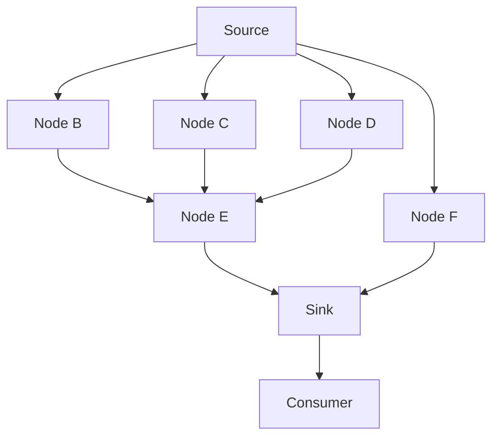

# Architecture

This document describes how Ataraxia is put together and why. It's the "current
mental model" doc — for the history of individual decisions (including rejected
alternatives), see [doc/adr/](adr/). When this doc and an ADR disagree, the ADR
is the historical record and this doc should be updated to match reality.

## System overview

The backtest is running the code against a shard of data (e.g. a single intraday
of OHLCV values). The code is implemented as a computable graph to enable
loosely-coupled, testable and composable execution units. The compute loop
injects dependencies for each computable node. The sink is the node from which
dependencies are created down to the source.

You can run the backtest via a CLI command and inspect per-shard results in the
output file.

Below is an example computable graph. It injects dependencies from the source
node down to the sink and the final sink consumer (usually the broker node).



### Current state vs. target state

Only the CLI-driven, local-file execution path is implemented today. Backtesting
processes shards sequentially, and each computation has one source. Parallel
execution, multi-source synchronization, and immutable artifact storage are
planned. The distributed/serverless deployment described later is a decided
direction (see ADR-0006, ADR-0007) but has no corresponding code here yet.

## Design goals & non-goals

### Goals

- Look-ahead bias is prevented by construction, not by convention
- Ataraxia is forked to a private repository by each user
- Visual strategy and features debugging having each compute step saved

### Non-goals

- Fully-autonomous trading agent.

## Core concepts / vocabulary

Shared definitions live in [Ubiquitous language](ubiquitous-language.md), the
single source of truth for the project's vocabulary.

The computable graph is an acyclic DAG of dependencies with attached runners.
Runners can hold computation state. Each runner's output is another runner's
input coupled via dependency injection.

Strategy is implemented as the sink of the graph. Computable nodes are features
or useful utilities like a `RollingWindow` node that accumulates a specified
amount of input and outputs it to their dependents.

Computable nodes must be hashable. The simplest way to achieve it is to define
them as frozen dataclasses. This ensures that the same generic computable node
can have different parameter values and be resolved as a different computable
node.

## Module map & boundaries

```text
compute/   — computable DAG core.  No knowledge of trading concepts.
bar        — normalized OHLCV input values.
provider   — context-managed reader for shard data.
source     — adapter from a provider to a graph input node.
feature    — built-in composable features.
broker     — process signals; position/PnL accounting.
backtest   — orchestration layer.
cli        — thin argparse wrapper around backtest.backtest_dir.
errors     — shared domain errors.
util       — shared graph/strategy-loading utilities.
```

`test/unit/`, `test/integration/`, and `test/acceptance/` exercise the
corresponding boundaries. `example/` holds a crossover strategy and its tests;
`sample/` holds synthetic CSV data. `doc/feat/` holds delivery specifications,
while [ADRs](adr/) record architectural decisions.

`make arch-check`, also run by `make ci-check` and `make ci`, uses Tach to
enforce the dependencies declared in `tach.toml`, as decided in
[ADR 17](adr/0017-enforce-module-dependencies-with-tach.md). The computation
boundary from [ADR 16](adr/0016-source-manages-its-own-provider-lifecycle.md)
permits `compute/` to depend only on its own modules and shared errors. Shared
errors have no internal dependencies, and neither module may import third-party
packages. Imports inside functions and `TYPE_CHECKING` blocks are checked too.
Configured modules cannot depend on undeclared project modules; add a module and
review its dependencies when extending the package.

Tach does not restrict standard-library imports or built-in I/O calls. Keeping
the computation engine independent of concrete I/O still requires code review.

## Compute engine (the DAG)

The computable graph in itself doesn't know anything about trading, features,
backtesting etc. It simply provides a framework to compute a loop while
injecting dependencies and allowing saving each step of computation in the loop.
Think about this graph as a graph of frozen dependencies, such as that the same
node class can be two different dependencies if they were instantiated with
different parameters, such as fast SMA and slow SMA being the same
implementation, but with different parameters.

- Computable graph is built from a single sink `Computable`, walked backward.
- Built-in nodes are frozen, hashable, value-equal dataclasses. Preserve stable
  equality and hashes so equivalent dependencies share computation. Pass the
  same source instance through dependent nodes
  ([ADR 12](adr/0012-source-node-computable-instance.md)):
  `SourceNode.factory()` returns the runner updated by `send()`.
- `compute()` owns the source context, and the source delegates resource
  management to its provider
  ([ADR 16](adr/0016-source-manages-its-own-provider-lifecycle.md)). Explicitly
  close the generator when stopping consumption early.
- Runner preparation binds dependency names against callable signatures before
  the source context opens. Missing required arguments, unexpected names,
  required positional-only arguments, and uninspectable signatures raise
  `DependencyError`. Defaults, keyword-only parameters, and variadic parameters
  follow Python binding rules; `**kwargs` therefore accepts arbitrary dependency
  names.
- Step results are read-only `ComputedMapping` instances. `step[node]` retains
  the node runner's result type; missing nodes still raise `KeyError`.
  Iteration, equality, and length remain available, but callers cannot assign
  step entries. Bulk mapping operations expose heterogeneous values as `object`.

### Type-checking limits

`make typecheck` (also run by `make ci`) checks positive `assert_type` cases and
required negative diagnostics in `test/typecheck/`. These cover result lookup,
source input, feature input, and runner calls. Negative cases use Pyrefly's
`--expectations` mode: missing expected errors and unexpected errors fail the
check.

`DependencyMapping` remains heterogeneous. Python's type system cannot connect
arbitrary dependency dictionary keys and node result types to a runner's named
parameters. Signature validation checks names and call shape, not value types or
annotations. Typed constructors and runner calls catch supported input
mismatches; custom wiring still needs execution tests. Nodes must keep
dependencies stable between graph preparation and execution, and equal nodes
must have compatible runners and result types.

The private result store erases heterogeneous value types. A single lookup cast
restores the relationship established when execution stores a node runner's
result; there is no public insertion API. Low-level `compute_step` callers must
use the matching catalog from `prime_catalog`; hand-built catalogs are not
statically verified node/runner pairs. Untyped strategies, explicit `Any`, or
dishonest annotations can still bypass static guarantees. Pyrefly can also infer
`Any` for an inline generic constructor under contextual typing: use a
separately inferred node variable or an explicit type argument, such as
`RollingWindow[int](node, 3)`. Typed lookup does not prove that a node belongs
to the graph. The dynamic strategy-loading boundary still validates broker
results at runtime.

## Backtesting contracts

- Strategy modules export a sink class as `__sink__`; backtesting constructs it
  with a source ([ADR 14](adr/0014-sink-module-file-special-attribute.md)).
- Rolling windows return newest first.
- The broker enters at the signal bar's close and evaluates exits on later bars
  ([ADR 13](adr/0013-broker-position-entry-needs-delay.md)).
- Prices and PnL use ticks, four per point for currently supported instruments.

Preserve these conventions unless a task explicitly changes them.

## Target execution / deployment model _(planned — not yet implemented)_

To process thousands of high-resolution intraday shards across many strategies,
ataraxia needs a horizontally scalable data processing pipeline.

- Fan-out mechanism: Lambda orchestrator -> EventBridge -> SQS -> Lambda worker
- Storage: S3
- Idempotency: strategy and shard hashes used to identify if the output artifact
  already exists.
- Fork-and-deploy model: users must deploy via provided IaC into their own AWS
  account.

## Testing strategy

- Unit tests - classic TDD approach, test comes before implementation. Tests run
  in isolation and do not cross boundaries.
- Integration tests - test components that integrate unit tested components and
  tests that cross boundaries.
- Acceptance tests - verify that running ataraxia the way the user would
  actually works.

## Open questions

- Strategy AST hashing for input artifact immutability and idempotency
- Multi-source DAG synchronization

## See also

- [doc/adr/](adr/) — decision log, in actual-decision order
- [README.md](../README.md) — quickstart, roadmap
- [CONTRIBUTING.md](../CONTRIBUTING.md) — dev workflow, project status
