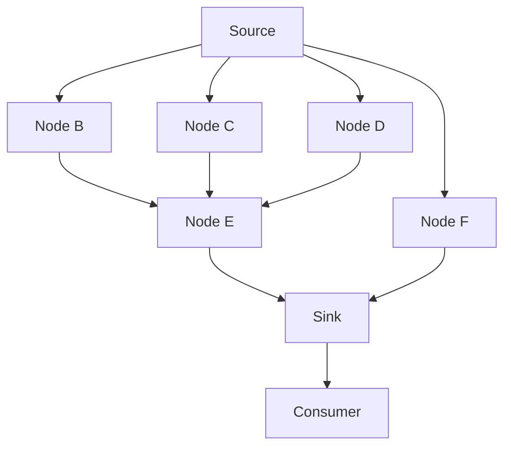

# Architecture

This document describes how Ataraxia is put together and why.  It's the "current mental
model" doc — for the history of individual decisions (including rejected alternatives),
see [doc/adr/](adr/).  When this doc and an ADR disagree, the ADR is the historical record
and this doc should be updated to match reality.

## System overview

The backtest is running the code against a shard of data (e.g. a single intraday of OHLCV values).  The code is implemented as a computable graph to enable loosely-coupled, testable and composable execution units.  The compute loop injects dependencies for each computable node.  The sink is the node from which dependencies are created down to the source.

You can run the backtest via a CLI command and inspect per-shard results in the output file.

The Python backtest API returns `BacktestShardReturn`: an `Account`, open and closed
`Position` sequences, and absolute `shard_path` and `strategy_path` strings.
`backtest_dir()` returns a tuple of these records. As decided in
[ADR 17](adr/0017-require-broker-results-from-backtests.md), backtesting validates the
final consumer value, or sink value when there is no consumer, and constructs the
complete record. Positions are copied to tuples; additional strategy fields are
outside the result contract. Invalid results raise `BacktestResultError`.

The CLI uses these typed results directly to aggregate accounts and write JSON.
It reports invalid-result errors without creating or overwriting the output file.
The generic compute engine continues to support arbitrary node values.

Below is an example computable graph.  It injects dependencies from the source node down to the sink and the final sink consumer (usually the broker node).



### Current state vs. target state

Only the CLI-driven, single-process, local-file execution path is implemented today.
The distributed/serverless deployment described later on is a decided direction
(see ADR-0006, ADR-0007) but has no corresponding code in this repository yet.

## Design goals & non-goals

**Goals**
- Look-ahead bias is prevented by construction, not by convention
- Ataraxia is forked to a private repository by each user
- Visual strategy and features debugging having each compute step saved

**Non-goals**
- Fully-autonomous trading agent.

## Core concepts / vocabulary

Shared definitions live in [Ubiquitous language](ubiquitous-language.md), the single
source of truth for the project's vocabulary.

The computable graph is an acyclic DAG of dependencies with attached runners.  Runners can hold computation state.  Each runner's output is another runner's input coupled via dependency injection.

Strategy is implemented as the sink of the graph.  Computable nodes are features or useful utilities like a `RollingWindow` node that accumulates a specified amount of input and outputs it to their dependents.

Computable nodes must be hashable.  The simplest way to achieve it is to define them as frozen dataclasses.  This ensures that the same generic computable node can have different parameter values and be resolved as a different computable node.

## Module map & boundaries

```
compute/   — computable DAG core.  No knowledge of trading concepts.
provider   — provider that reads the shard data.
feature    — built-in composable features.
broker     — process signals; position/PnL accounting.
backtest   — orchestration layer.
cli        — thin argparse wrapper around backtest.backtest_dir.
```

## Compute engine (the DAG)

The computable graph in itself doesn't know anything about trading, features, backtesting etc.  It simply provides a framework to compute a loop while injecting dependencies and allowing saving each step of computation in the loop.  Think about this graph as a graph of frozen dependencies, such as that the same node class can be two different dependencies if they were instantiated with different parameters, such as fast SMA and slow SMA being the same implementation, but with different parameters.

- Computable graph is built from a single sink `Computable`, walked backward.
- Nodes are frozen, hashable, value-equal dataclasses (see ADR-0009, ADR-0012).

## Target execution / deployment model _(planned — not yet implemented)_

To process thousands of high-resolution intraday shards across many strategies, ataraxia needs a horizontally scalable data processing pipeline.

- Fan-out mechanism: Lambda orchestrator -> EventBridge -> SQS -> Lambda worker
- Storage: S3
- Idempotency: strategy and shard hashes used to identify if the output artifact already exists.
- Fork-and-deploy model: users must deploy via provided IaC into their own AWS account.

## Testing strategy

- Unit tests - classic TDD approach, test comes before implementation.  Tests run in isolation and do not cross boundaries.
- Integration tests - test components that integrate unit tested components and tests that cross boundaries.
- Acceptance tests - verify that running ataraxia the way the user would actually works.

## Open questions

- Strategy AST hashing for input artifact immutability and idempotency
- Multi-source DAG synchronization

## See also

- [doc/adr/](adr/) — decision log, in actual-decision order
- [README.md](../README.md) — quickstart, roadmap
- [CONTRIBUTING.md](../CONTRIBUTING.md) — dev workflow, project status
