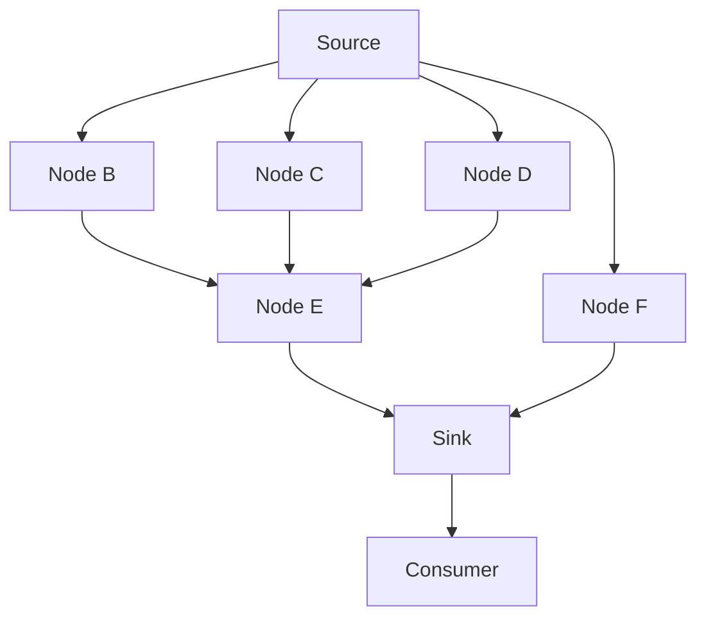

# Architecture

This file explains current system relationships, boundaries, and limitations.
[Ubiquitous language](ubiquitous-language.md) owns definitions;
[ADRs](adr/) preserve decisions and rationale. Check code and tests for
implementation status; accepted decisions can still be unimplemented.

## Current execution

The CLI runs a strategy over local CSV shards, directly or in supervised spawn
workers, and writes JSON shard outcomes. Each backtest uses one source; multi-source synchronization is not
implemented. Directory discovery is unsorted and unfiltered. Ordinary shard failures
produce error diagnostics and processing continues; successful envelopes contain
nested broker results. Parallel deadlines and worker replacement belong to the
[parallel execution slice](feat/parallel-execution.md).
See [backtest.py](../src/ataraxia/backtest.py) and [cli.py](../src/ataraxia/cli.py).

The graph is built backward from the sink or its selected consumer, then evaluated
in dependency order for each source item. The loop injects dependency values into
runners. For example, branches can share a source and recombine before the sink:

## Module boundaries

| Module | Responsibility |
| --- | --- |
| `compute/` | Graph preparation and computation loop |
| `provider` / `source` | CSV input and adaptation into the graph |
| `feature` | Built-in composable calculations |
| `broker` | Signals, positions, and PnL accounting |
| `backtest` / `shard_pool` | Strategy loading and shard orchestration / worker supervision |
| `shard_types` | Shard input, outcome, diagnostic contracts and boundary validation |
| `cli` | Argument parsing, console output, and result-file writing |
| `errors` | Shared domain errors |

[Tach configuration](../tach.toml) owns permitted imports, enforced under
[ADR 17](adr/0017-enforce-module-dependencies-with-tach.md). Checks include imports
inside functions and `TYPE_CHECKING` blocks; declare new modules and review their
dependencies when extending the package. Tach does not restrict standard-library
imports or built-in I/O, so computation's independence from concrete I/O still
needs review. Follow [engineering conventions](engineering.md) and
[validation procedure](../CONTRIBUTING.md#make-targets).

## Computation contracts

Equal nodes share computation through stable equality and hashes. Specifications
are commonly frozen dataclasses; fast and slow SMAs can use the same node class
with different parameters. Dependencies must remain stable between preparation
and execution. Equal nodes must have compatible runners and result types.

Preserve source/runner identity from
[ADR 12](adr/0012-source-node-computable-instance.md), resource ownership and
computation's I/O boundary from
[ADR 16](adr/0016-source-manages-its-own-provider-lifecycle.md), and strategy loading
from [ADR 14](adr/0014-sink-module-file-special-attribute.md).
Explicitly close the compute generator when stopping consumption early.
[Rolling windows](../src/ataraxia/feature.py) return newest first.

Runner preparation validates keyword dependency wiring before opening the source
context. Missing or unexpected names, required positional-only arguments, and
uninspectable signatures raise `DependencyError`. Defaults, keyword-only and
variadic parameters follow Python binding rules; `**kwargs` accepts arbitrary
names. This checks call shape, not value types or annotations.

### Type guarantees and limits

Step results are read-only `ComputedMapping` instances: `step[node]` retains the
runner's result type and raises `KeyError` for absent nodes. Iteration, equality,
and length are supported; bulk operations expose heterogeneous values as `object`.
The private store erases value types and one lookup cast restores the relationship
established by execution. There is no public insertion API.

Python cannot connect arbitrary dependency dictionary keys and node result types
to named runner parameters. Typed constructors and runner calls catch supported
input mismatches; custom wiring needs execution tests. Low-level `compute_step`
callers must use the matching catalog from `prime_catalog`; hand-built catalogs
are not statically verified node/runner pairs. Typed lookup does not prove graph
membership. Dynamic strategy loading validates broker results at runtime.

Untyped strategies, explicit `Any`, and dishonest annotations can bypass static
guarantees. Pyrefly can infer `Any` for an inline generic constructor under
contextual typing: use a separately inferred node variable or explicit argument,
such as `RollingWindow[int](node, 3)`. [Type expectations](../test/typecheck/compute_contracts.py)
exercise precise results and invalid uses; their required checks follow
[contribution guidance](../CONTRIBUTING.md#make-targets).

## Trading limitations

Input normalization currently supports the instruments and tick units defined
under [Bar](ubiquitous-language.md#trading-and-backtesting). Prices and PnL use
those tick units, not points or cash. There is no cost calculation or portfolio
tracking beyond realized and unrealized PnL.

The broker uses simplified fills: market entry at the signal bar's close, with
required stop-loss and take-profit levels. It evaluates exits on subsequent bars,
as permitted by [ADR 13](adr/0013-broker-position-entry-needs-delay.md).
Warm-up data separate from the source is unsupported. These limitations do not
change during the parallel execution work.

## Planned capabilities

Local parallel execution is implemented on the feat branch; its validation and
review stage live in the [parallel execution slice](feat/parallel-execution.md).
[ADR 18](adr/0018-supervise-process-workers-for-shard-timeouts.md) owns the
supervision rationale.

Persisting computation steps for visual debugging is decided in
[ADR 5](adr/0005-save-every-computation-step-for-debugging.md) but unimplemented.
The [README roadmap](../README.md#roadmap) owns delivery priorities. Fully autonomous
trading is outside the project's goals.

## Target execution and deployment

Cloud execution is planned, not implemented. Its current topology is orchestrator
-> SNS -> SQS -> Lambda, with S3 storage. The specific cloud topology has not yet
been recorded in a dedicated ADR; architectural choices must follow the
[ADR workflow](adr-workflow.md) before implementation.

Reuse the directions in [ADR 6](adr/0006-massive-parallelism-via-sharding.md),
[ADR 7](adr/0007-idempotency-and-immutability-of-backtester-runs.md), and
[ADR 15](adr/0015-fork-and-deploy-model.md). Cloud artifact resolution and delivery
policies remain separate from graph computation and local supervision.
Open questions include strategy AST hashing and multi-source synchronization.
