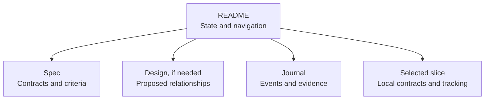

# Documentation ownership

Read this file when creating, changing, or reviewing documentation. It owns
placement and maintenance rules; [AGENTS.md](../AGENTS.md) owns task routing.

## Owners

| Information | Authoritative location |
| --- | --- |
| Mandatory startup and conditional reading routes | [AGENTS.md](../AGENTS.md) |
| Documentation placement and duplication rules | This file |
| Shared meanings and distinctions | [Ubiquitous language](ubiquitous-language.md) |
| Delivery stages, approval gates, handoffs, and specification guidance | [Feat workflow](feat-workflow.md) |
| Reusable feat document scaffolds and metadata profiles | [Feat templates](feat-templates.md) |
| ADR eligibility, granularity, format, and amendment procedure | [ADR workflow](adr-workflow.md) |
| Coding, typing, and testing conventions | [Engineering](engineering.md) |
| Setup, validation procedure, toolchain maintenance, contribution policy, commits, and PRs | [CONTRIBUTING.md](../CONTRIBUTING.md) |
| Current system relationships, boundaries, and limitations | [Architecture](architecture.md) |
| Introduction, runnable example, and roadmap priorities | [README.md](../README.md) |
| Local scope, acceptance contracts, validation evidence, and handoff | The relevant [feat/slice package](feat/), using the [owner map](#feat-documents) |
| One architectural choice and its rationale | The relevant [ADR](adr/) |
| Issue body format | [Issue template](../.github/ISSUE_TEMPLATE/work-item.md) |
| Machine-enforced settings and executable checks | Their configuration and implementation, including [pyproject.toml](../pyproject.toml), [Makefile](../Makefile), and [tach.toml](../tach.toml) |

## Placement and maintenance

Find the owner before adding information. Update it and link from other documents
to the relevant section. Navigation summaries may name a capability and its
status, but must not repeat defaults, schemas, lifecycle rules, or procedures.
Examples may demonstrate a contract without becoming a second definition of it.
Derive deterministic information from executable configuration where practical;
documentation explains its use rather than maintaining another settings inventory.

Keep AGENTS small. Add guidance to its existing owner. Create a document only for
a distinct responsibility with a clear reading trigger; add a route only when
the existing routes cannot discover it. Do not split files merely to move their
size elsewhere or create a chain of indexes agents must read on every task.

Separate current guidance, proposed behavior, accepted decisions, implemented
behavior, and evidence. Accepted ADRs explain decisions, not implementation
status. Verify current behavior in code and tests. If behavior conflicts with an
approved contract, surface the mismatch rather than silently treating code as
the intended design. Resolve inconsistent copies at the owner and remove or link
the others; do not add an exception to reconcile them.

Keep accepted ADR history intact, using the [ADR workflow](adr-workflow.md) to
change decisions. Validated feat slices preserve the scope and evidence of their
delivery; add a brief historical note when needed instead of rewriting their
acceptance criteria to match later guidance. A new change owns its own evidence.
Issue and PR records link to detailed scope and evidence rather than copying it.

## Feat documents

Use `doc/feat/<issue>-<short-name>/README.md`, `spec.md` and `journal.md`.
Add `design.md` when proposed relationships need explanation, and `slices/` for
independently usable outcomes. A compact child slice can be one Markdown file;
give it a directory only when it needs separate contracts, design or evidence.
Use the [templates](feat-templates.md) without creating empty scaffolds.

| Document | Owns | Changes |
| --- | --- | --- |
| Overview `README.md` | Current status/stage, own tracking, approval pointer, next action and navigation | Update at gates and handoffs |
| Specification or compact slice body | Scope, observable contracts, invariants, acceptance criteria and delivery dependencies | Material approved changes return through [specification review](feat-workflow.md#execute-the-approved-scope) |
| Design | Proposed responsibilities, architecture delta and dependencies | Covered material design changes return for review |
| Journal | Consequential decisions, investigations, approvals and execution evidence | Append; correct earlier events by linking a new entry |
| Compact slice frontmatter | Its status/approval/tracking and registered steps | Update its own state; parent overview links here |

This view routes questions to their owner; the table owns the precise boundaries.
Keep journals separate from contract bodies. Approval events identify covered
paths and revision; compare their contract/design text against that revision,
not just ancestry. Metadata cannot establish approval. Repository architecture
continues to own current relationships and ADRs own consequential decision rationale.
Use one set of clear documents for humans and agents. Preserve approved and
historical records; move or retrofit them only through a reviewed migration.

## Vocabulary

Check the glossary before introducing a term. Define new shared terms there
before using them in specifications or implementation: meaning, responsibility,
distinctions, relationships, and essential units or lifecycle meaning. Choose the
section matching the responsibility; keep delivery workflow language separate
from computation and trading language. Feat slices own local behavior and
parameters; glossary entries link to them rather than reproducing their rules.

Reuse abstractions when their meaning fits. Qualify terms at boundary mappings.
Resolve ambiguity from the request and repository; if interpretations still
imply materially different behavior, present concrete alternatives before
implementation. Do not invent domain rules. Consistent naming needs no approval.

## Review

Check ownership and duplication when defining and reviewing a feat slice, and
when changing general guidance. Verify local links and anchors, distinguish
history from current instructions, and walk through affected reading routes.
Check that moved requirements remain discoverable and that examples agree with
their owning contracts. Follow [repair and scope rules](engineering.md#fix-the-underlying-problem)
for cohesive changes.

Background: [Thoughtworks](https://www.thoughtworks.com/insights/blog/evolutionary-architecture/domain-driven-design-in-10-minutes-part-one),
[Fowler and Joshi](https://martinfowler.com/articles/convo-llm-abstractions.html),
[Schleicher](https://www.danielschleicher.com/software/engineering,/ai,/spec-driven/development/2026/01/04/removing-ambiguity-with-spec-driven-development.html).
