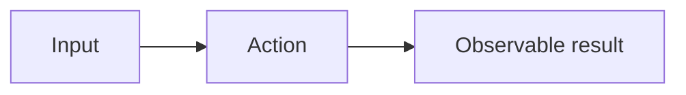

# Feat document templates

Read when creating a feat package, child slice or journal entry. Use
[document ownership](documentation.md#feat-documents) to choose files and
[workflow gates](feat-workflow.md#delivery-branches-and-review-gates) to proceed.
These are scaffolds for new documents; preserve approved bodies and historical
slices until a reviewed migration. Replace example IDs, tracking values and all
angle-bracket placeholders before publication. Examples register no real work.

## Frontmatter profiles

Each new feat document has a unique stable `id` and `kind`. Paths do not define identity.
Use the fields for its profile; reject duplicate keys. IDs never change on moves
or get reused after retirement. `owner` and `parent` resolve to feat/slice IDs.

| Kind | Identity and ownership | State and tracking |
| --- | --- | --- |
| `feat` | `id`; overview at `README.md` | `status`, `stage`, `issue`, `pr`, `branch`, `base_branch`, `base_revision`, `approved_revision`; candidate/review pointers when published |
| `slice` | `id`, `parent`; compact file or its own `README.md` | Same state/tracking fields; `steps` registers agreed delivery steps |
| `spec`, `design`, `journal` | `id`, `kind`, `owner` | No mutable delivery state; route to the owning overview or compact slice |

`status` follows the [workflow meanings](feat-workflow.md#specification-status).
Issue/PR values are positive integers; `pr: null` is allowed while preparing.
Branches/stages are nonempty strings. `base_revision` is the quoted full SHA of
the branch's inspected starting commit. Candidate, approval and review pointers
are null before their event, otherwise quoted full Git SHAs. Optional
`specification_revision` identifies a committed candidate; review uses
`review_base_revision` and `review_revision`. `approved_revision` names the revision
authorized by a linked scoped approval event. Checks and metadata cannot approve it.

Example compact slice frontmatter. For a feat, set its own `id`, `kind: feat`
and declared integration base; omit `parent` and `steps`:

```yaml
---
id: F42-01
kind: slice
parent: F42
status: proposed
stage: preparing-review
issue: 43
pr: null
branch: feat/example-slice
base_branch: feat/example
base_revision: "<full-base-sha>"
approved_revision: null
steps: []
---
```

Register only agreed steps. Each `steps` item has `id: STEP-n`, `issue`, `pr`,
`branch`, `base_branch`, quoted `base_revision` and `stage`. Its base is the slice;
corrections reuse it. Candidate/review pointers can also appear on a slice overview.
For a separate specification, use only:

```yaml
---
id: F42-01-SPEC
kind: spec
owner: F42-01
---
```

Change `kind` and document ID for a design or journal, keeping the same owner.

## Overview scaffold

Start with the outcome, then these headings. Use standard relative Markdown links.

| Heading | Fill with |
| --- | --- |
| Review entry point | One decision, exact revision/range, artifact and evidence links, review estimate |
| Navigation | Spec, optional design, journal, selected child; what each owns and when to read it |
| Delivery order | Independently usable slices and dependencies; omit when there are no children |
| Current handoff | Current next action, approval-event link and scope, evidence/review limits; route to child tracking rather than copying it |

Maintain state in frontmatter and link its approval evidence. Do not copy the
journal timeline or contracts into the overview.

## Specification scaffold

Use this body with `kind: spec`, or in a compact `kind: slice` document.
Give each invariant one falsifiable statement. Decisions state `settled`,
`assumed` or `open`, with permitted work and an explicit stop condition.

````markdown
# <Observable outcome>

## Baseline and outcome
<Inspected revision, verified current behavior, intended result.>

## Scope and non-goals
<Included behavior, exclusions and compatibility to preserve.>

## Contracts and invariants
<Observable interfaces/examples and one requirement per invariant.>

## Decisions and stop conditions
| Decision | State | Permitted work / stop condition |
| --- | --- | --- |
| <Choice> | open | <What must be resolved before affected work proceeds> |

## Visual review
<One question answered by this view; link its [contract](#contracts-and-invariants).>

<This illustrates AC-1; the contracts above own its precise requirements.>

## Acceptance criteria
| ID | Preconditions and action | Observable outcome | Verified by |
| --- | --- | --- | --- |
| AC-1 | <Given / action> | <Falsifiable result> | <Specific test/check or recorded manual evidence> |

## Delivery dependencies and steps
| Outcome | Criteria | Indicative paths | Checks and exit condition | Review decision |
| --- | --- | --- | --- | --- |
| <One small result> | AC-1 | <Paths> | <Commands once known / completion condition> | <Accept, correct or defer what?> |
````

Acceptance IDs belong to the specification's `owner` or compact slice's `id`.
Definitions are unique across that scope; external references qualify it, such
as `F42-01:AC-1`. Preserve retired IDs. `Verified by` names evidence to obtain;
passing results, limitations and their revisions belong in the journal.

## Design scaffold and visuals

Add a design only when proposed relationships need explanation. Link its spec
and ADRs; repository architecture owns current relationships. Use these headings:

| Heading | Fill with |
| --- | --- |
| Responsibilities and interfaces | Proposed owners and boundary contracts |
| Architecture delta | What changes relative to the inspected architecture |
| Alternatives and dependencies | Consequential choices and prerequisites |
| Risks and open decisions | Uncertainties and stop conditions |
| Visual review | One relationship question, Mermaid view and owning prose links |

Give specifications behavior views and designs relationship views using Mermaid.
Each answers one question, uses shared vocabulary and links its owning prose/IDs.
Keep layout stable where practical; show material changes. Inspect the rendered
view for readability and agreement with the prose. The existing
[specification views](feat/28-reviewable-workflow/spec.md#visual-overview) and
[design views](feat/28-reviewable-workflow/design.md#visual-overview) are worked
examples; diagrams do not establish acceptance evidence.

## Journal entry scaffolds

Begin each event with its heading and first fenced YAML mapping, then prose.
Choose `investigation`, `decision`, `execution`, `review`, `approval` or
`correction`. A correction fixes an earlier journal record and links it in prose.
Plans and handoffs accompany events; they do not add kinds. IDs use `J-n`, unique
across journals for the owner; external references use `<owner>:J-n`.

Copyable decision and approval shapes:

````markdown
## J-<n>: <Decision>

```yaml
id: J-<n>
date: "YYYY-MM-DD"
kind: decision
role: defining
session:
  provider: <provider>
  thread_id: "<native-thread-id>"
```
<Choice, rationale, consequences and ordinary Markdown evidence links.>

## J-<m>: <Scoped approval>

```yaml
id: J-<m>
date: "YYYY-MM-DD"
kind: approval
role: defining
session:
  provider: <provider>
  thread_id: "<native-thread-id>"
revision: "<full-approved-sha>"
scope:
  - doc/feat/<issue>-<name>/spec.md
```
<Exact human instruction or evidence link, covered outcome and limits.>
````

Metadata IDs match headings; dates are quoted ISO calendar dates. Roles are
`defining` or `executor`; `review` also requires a quoted full `revision`.
Approval `scope` is a nonempty list of covered repository-relative paths. Reject
duplicate keys and fields outside these profiles and kind-specific additions.
Keep native `provider`/`thread_id` together in each event, obtained from trusted
runtime metadata. Codex thread IDs are UUIDs; other providers need explicit
identity profiles. If unavailable, use `thread_id: null`
and a nonempty `identity_unavailable_reason` outside `session`. Never invent or
copy an example identity. Display names and delivery roles do not change identity.
Use no session registration, aliases or YAML references list; links stay in prose.

Append consequential events. Correct earlier entries by appending and linking
them; preserve IDs across moves/splits. Legacy records need an explicit historical
boundary, not a blanket exemption for new entries. Schema validity proves neither
native identity nor human approval. Checker schemas and automation remain later
delivery work; these formats do not claim that `make docs-check` exists.
