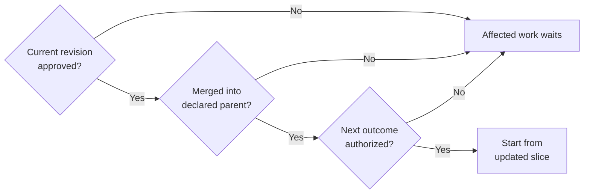

# Feat slice workflow

Read this file in full when defining, implementing, or reviewing a
[feat slice](ubiquitous-language.md). It owns the delivery workflow and
specification-writing guidance. Use [documentation ownership](documentation.md) for placement rules,
[CONTRIBUTING.md](../CONTRIBUTING.md#make-targets) for validation, and the
[ADR workflow](adr-workflow.md) for architectural decisions.

## Stepwise changes and commits

Before making changes, both defining and executor sessions write a short ordered
plan showing how the work progresses toward its completion conditions. For each
step, state the intended outcome, cohesive changes, and relevant verification.
This applies to specification work, implementation, and review corrections.
Keep a feat slice's plan in the slice; share the initial plan in the conversation
before drafting it. For small unrelated work, a plan in the conversation is
enough; this rule does not require a feat slice or its approval gates.

Execute the plan step by step. Verify each completed step and, if it changes
repository files, commit it before starting the next step. Keep commits small and
cohesive, preserving a working path; do not defer all commits until the end.
Steps without file changes need no empty commit. Use the
[commit and validation conventions](../CONTRIBUTING.md#commits-and-pull-requests)
and [required repository checks](../CONTRIBUTING.md#make-targets).

Present each agreed outcome with the [review artifact template](#review-artifact-template)
before dependent continuation. Requested corrections reuse that step's issue,
branch and PR. Follow the [delivery review gates](#delivery-branches-and-review-gates);
independent work proceeds only within the maintainer's authorization.

If findings change the approach, revise the remaining plan and explain why before
continuing. Material contract changes still follow the
[scope approval gate](#execute-the-approved-scope). Keep completed step commits
on the branch so the evolution remains traceable; do not squash or rewrite them
unless the maintainer explicitly requests it.

## Delivery branches and review gates

Each feat, feat slice and agreed delivery step has its own issue, branch and PR:

| Level | Branch starts from and PR targets |
| --- | --- |
| Feat | Declared integration base under [contribution guidance](../CONTRIBUTING.md#submitting-a-change) |
| Feat slice | Its feat branch |
| Delivery step | Its updated slice branch |

Create a slice issue before delivery and a step issue when its outcome is agreed.
Register stable slice-local `STEP-n` IDs; external references name the slice,
such as `F28-01:STEP-2`. Record parent, issue, PR, branch and base revision in the
handoff or its owning metadata. Outline rows do not require issues until selected.
Never renumber or reuse step IDs. Verify the actual PR target and head; a wrong
target must be corrected before merge.

Before the next dependent step, require approval of the current artifact at its
named revision, its reviewed merge into the slice, and authorization for the next
outcome. A merge alone does not authorize the next outcome. Passing checks,
silence or elapsed time are not approval and do not authorize continuation.
Verify the merge, fetch the updated slice and start the next step branch from
that revision.

The prose owns the complete gate; this view shows dependent continuation.
Slice and feat integration reviews link accepted child PRs and actual acceptance
evidence. New integration changes receive a bounded step review; a large aggregate
diff does not establish a short review. Keep incomplete integration PRs draft.
Run required CI for every published branch and verify integration with its actual
parent before merge. Missing required evidence keeps the review incomplete.
The maintainer merges or closes PRs; agents prepare them and never enable automatic
merging. Record completion explicitly for issues targeting non-default branches;
closing keywords may not close them. The maintainer closes completed issues.

## Define and publish for specification review

After reading the glossary and relevant context, inspect the current branch,
working tree, and existing issues/PRs. Reuse the current step's branch for
corrections; start an authorized new outcome from its
[declared parent](#delivery-branches-and-review-gates). Preserve unrelated work;
don't base unrelated work on an existing feat branch. Explicit task instructions
determine the integration base, otherwise use
[contribution guidance](../CONTRIBUTING.md#submitting-a-change).

Name branches `feat/<short-kebab-case-name>`, for example
`feat/parallel-shard-computation`. Validate with
`git check-ref-format --branch <name>`. No issue number is required because the
branch comes first. Existing branches need not be renamed.

Create or reuse an issue before drafting the specification or doing non-trivial
architectural work. Follow [Issue messages](#issue-messages). State whether the
issue's outcome is an accepted specification or an implemented capability. Write
the specification in `doc/feat/`, link the issue, follow
[documentation ownership](documentation.md), and use the
[ADR workflow](adr-workflow.md) when decisions are needed.

Once the planning documents are reviewable, run `make ci`, commit and push, and
open a draft PR against the applicable base. Add links between the issue, feat
slice, and PR. Use `Refs #N` for partial delivery, including specification-only
work on an implementation issue; use `Closes #N` only when merging completes the
issue. GitHub closing keywords apply to PRs targeting the default branch.

Stop at manual specification review. The maintainer must explicitly approve
execution of the identified specification revision before implementation starts.
Record the approval and revision in the handoff. Silence, passing checks, an
agent review, or creating a PR is not approval. An explicit instruction to
execute an already reviewed scope is approval; don't ask for it again.

## Execute the approved scope

The executor session may be a later session using a different model. It reads
the glossary, this workflow, the approved specification, applicable ADRs, and the
handoff before implementing. If approval is missing or ambiguous, resolve that
gate with the maintainer before execution. Continue independent preparation.

Implement one authorized outcome on its delivery-step branch and PR. Run focused
checks and the required repository checks, record results and limitations in the
feat slice, and update the issue with the stage and links to current evidence. Keep the issue
short; don't copy the specification or test results into a second record.
Commit and push checked changes so the PR reflects the delivered implementation.

If findings change scope, acceptance criteria, interfaces, architecture, semantics
or a consequential design choice, pause affected implementation. Present the
proposed change in the owning specification/design and applicable ADRs; verify,
commit and publish that planning revision for explicit approval before executing
it. An earlier approval cannot cover the changed contract automatically. Routine
implementation choices and corrections within approved scope can proceed in the
same step PR; recheck them and present the changed revision for review. Report
unresolved problems rather than weakening completion conditions.

## Review and revise

After execution, stop for manual implementation review and review by the defining
session. The defining session checks the delivered diff, acceptance examples,
validation evidence, and any specification changes against the approved scope.
Report findings according to the glossary's session responsibilities.

Record the commit each review covers and its outcome in the handoff or a linked
issue/PR review. The executor addresses proposed changes, reruns relevant checks
and `make ci`, updates evidence, and pushes to the same PR. Repeat the affected
reviews until findings are resolved. Check documentation ownership and duplication
alongside contracts and validation; follow
[documentation review](documentation.md#review). Review the changes from later pushes;
approvals of earlier commits do not automatically approve new changes. Material
contract changes also return to specification approval.

Keep the PR draft while required approvals or reviews are outstanding. Once
completion conditions, checks, manual review, and defining-session review pass,
record that evidence and mark it ready for the maintainer's final decision.
The maintainer manually merges accepted work or closes the PR without merging.
Agents do neither and don't enable automatic merging.
Record the observed merge separately from approval; dependent continuation follows
the [delivery review gates](#delivery-branches-and-review-gates).

Specification-only delivery follows the manual specification gate and ends when
the maintainer accepts that planning outcome. It doesn't require implementation
review of code that wasn't delivered or validate a future implementation. The
maintainer still makes the final GitHub decision.

## Specification status

A specification is `proposed` before execution, `in progress` during delivery,
and `validated` after its acceptance criteria and required checks pass. State
whether completion delivers an accepted specification or implemented behavior.
Validation does not authorize execution or merging; approvals and pending work
belong to the handoff stage.

## Roles and handoffs

Use the glossary's [defining session and executor session](ubiquitous-language.md)
responsibilities. Record roles separately from the native conversation identity
using the [journal entry profile](feat-templates.md#journal-entry-scaffolds).
If the defining session is unavailable, the maintainer explicitly
designates a replacement reviewer; the executor doesn't waive that review.
If roles share a session, disclose that fact rather than claiming an independent
review. Respect any requirement from the maintainer for separate sessions.

Keep a small current handoff in the owning overview or compact slice following
[document ownership](documentation.md#feat-documents). It contains or routes to:

- Current workflow stage and the defining/executor roles with native identity.
- Link to the stepwise plan, completed steps with their commits, and the next step.
- Approved specification commit and evidence of the maintainer's approval.
- Branch, issue, PR, and applicable ADR links.
- Current validation evidence or links to it, including limitations.
- Unresolved findings and reviews with the commits they cover.

Keep the handoff current at each gate and session transfer. A new session should
be able to continue from these records without relying on conversation memory.
Keep specification status consistent with the evidence and the handoff stage.

## Review artifact template

Use this template for each iteration. The
[worked discovery example](feat/28-reviewable-workflow/journal.md#j-14-deliver-the-review-template-and-example)
uses recorded evidence. Keep the entry point short; link to detailed evidence.

| Field | Fill with |
| --- | --- |
| Outcome | One question or result, its scope, and affected acceptance IDs |
| Inspect | Exact revision or comparison range, affected files, and direct artifact/evidence links |
| Evidence | Commands and observed results, failed or unrun checks, and limits; for discovery, hypothesis, alternatives, stopping condition, probe and versions |
| Consequences | Consequential choices and effects on architecture, vocabulary, compatibility or debt; scoped structural review |
| Decision requested | The specific artifact or choice for the maintainer to accept, correct or defer |
| Next | One proposed next iteration and whether it is authorized or awaiting approval |
| Review effort | Rough initial review estimate and actual maintainer feedback, or explicitly pending feedback |

The maintainer inspects changes in Magit, GitHub or their editor/IDE; identify the
range and files without pasting the diff into chat. Link a compact visual when it
helps answer the review question. The agent can use Mermaid when applicable,
especially for diagrams in Markdown documentation. Current approval and review
rules remain in their owning sections above; this template presents evidence for
those decisions.

## Failures and boundaries

Follow [validation procedure](../CONTRIBUTING.md#make-targets) if network
access prevents `make ci`. Disclose missing checks and keep incomplete work draft.
If GitHub access fails, report it, continue useful local work, and add external
links once access returns. Don't claim an issue or PR exists without verifying
it. If the missing issue blocks architectural work under the ADR workflow,
finish local preparation without implementing the affected design.

Small unrelated fixes or documentation edits need neither a feat slice nor this
workflow. Non-trivial work still needs an issue under contribution guidance;
substantive architectural decisions still follow the ADR workflow.

## Issue messages

Use descriptive sentence-case titles naming the problem or desired capability,
such as `Add parallel execution across shards`. No type prefix is required;
classify with existing labels where useful.

Use the [Markdown issue template](../.github/ISSUE_TEMPLATE/work-item.md) as the
authoritative body format for both manual and agent-created issues. Follow its
Problem, Outcome, and Links prompts; add scope boundaries or open questions when
they affect the decision. Keep the issue a short tracking record: the feat slice
owns detailed scope, acceptance examples, and validation,
while ADRs own architectural decisions. Link those records instead of copying
their specifications into the issue. Add links as artifacts become available.

For CLI creation, fill the template's body into a temporary Markdown file and
pass it with `gh issue create --title ... --body-file <file>`; omit the template's
front matter and instructional comments. The template guides content but doesn't
enforce it across every GitHub creation path.

## Writing feat slices

Write proportional specifications in `doc/feat/` using short prose and examples;
no user-story formula or Gherkin is required. Follow the gates above,
[documentation ownership](documentation.md), and the [ADR workflow](adr-workflow.md).
Keep local contracts and evidence in their [package owners](documentation.md#feat-documents);
link to shared meanings, architectural rationale and general procedures instead
of copying them.

Use [document templates](feat-templates.md) for new packages and child slices;
frontmatter owns their identity and state, while contracts and journals stay
separate. The templates provide predictable places for decisions, stop conditions
and falsifiable invariants. Existing historical slices preserve their delivery
records rather than receiving an automatic retrofit.

- Lead with the problem, code-verified current behavior, and observable outcome. State status (`proposed`, `in progress`, or `validated`); link issues and applicable ADRs as decisions emerge.
- Scope a small usable increment across necessary components; split larger work by scenario or capability. State non-goals and dependencies; separate preparatory refactors and experiments. Plan short, tested steps that preserve a working path and provide early feedback; make scope/contract changes explicit.
- Give acceptance examples with preconditions, inputs, action, and expected outputs or side effects. Cover correctness, failures, boundaries, and behavior to preserve through observable contracts. Identify focused, integration, or CLI checks; refine scenarios as needed. Separate validation plans from results, recording evidence and limitations. Mark validated only after acceptance criteria and required repository checks pass.
- Separate required interfaces, ordering, compatibility, and resource ownership from provisional design. Sketch only enough internals to establish feasibility and consequential tradeoffs.
- Name assumptions, risks, and open questions. Test uncertainty that could invalidate the approach with a bounded experiment: expected result and evidence that would challenge it. Record findings and revise the plan; an experiment is not a completed feature.
- Support performance claims with a baseline, representative workload, measurement method, and success criterion.

Examples such as successful results matching across execution modes or an
invalid CLI argument preserving an existing output file express observable
contracts. They are illustrative, not requirements for every slice. Executor
classes and scheduling helpers belong in design notes unless architectural
impact warrants an ADR.

Background: [Thoughtworks](https://www.thoughtworks.com/en-au/insights/e-books/modern-data-engineering-playbook/delivery-planning-principles), [Fowler](https://martinfowler.com/bliki/FeatureDevotion.html), [Beck](https://newsletter.kentbeck.com/p/canon-tdd), [Farley](https://www.davefarley.net/?page_id=50).
