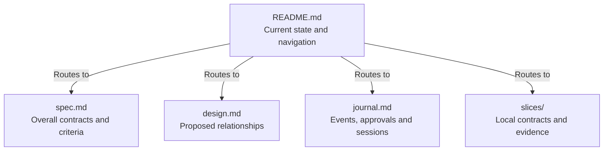
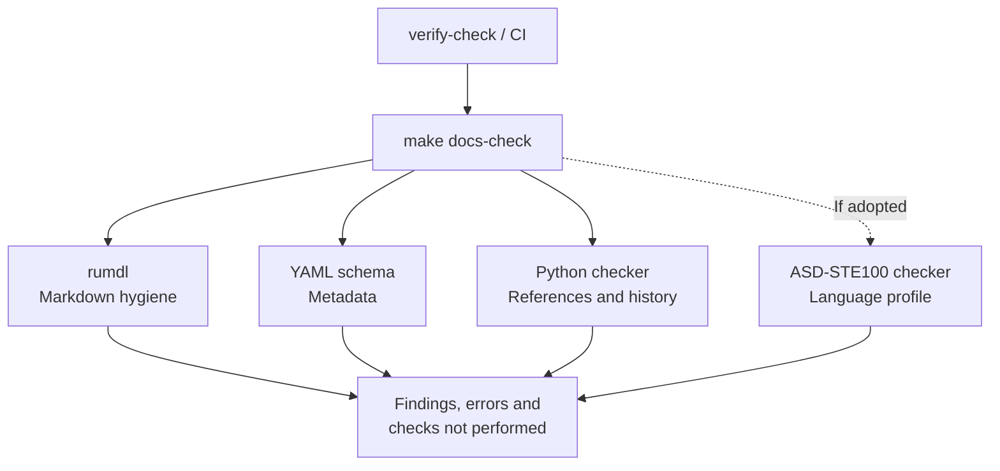
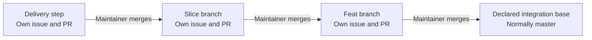

# Proposed workflow design

## Visual overview

### Where does each fact live?



Read the overview, then follow the route for the question under review.
[Documents and revisions](#documents-and-revisions) owns the placement and
mutability rules; separate child directories and journals are optional.

### How do the proposed documentation gates fit together?



Tool choices await [investigation](slices/02-tool-investigations.md). The dashed
branch depends on the STE disposition; required adopted checks cannot silently
skip. Optional network checks run separately. See
[checker composition](#checker-composition) and
[selection and truthful results](#selection-and-truthful-results) for the full
contract, including dependency-aware selection and required inputs.

## Documents and revisions

### How do reviewed changes reach the integration base?



Each arrow is a reviewed merge boundary. For this feat, the final arrow targets
`feat/parallel_execution` as already requested; that prerequisite has its own
PR to `master`. See the
[tracking contract](spec.md#delivery-tracking-and-merge-boundaries).

Use `doc/feat/<issue>-<short-name>/README.md`, `spec.md`, and `journal.md`.
Add `design.md` when relationships or architecture changes need explanation, and
`slices/` when there are independently reviewable delivery outcomes. A small
child slice can be one Markdown file; give it a directory only when it needs
distinct specification, design, or evidence files. Do not create empty scaffolds.

`README.md` is the human entry point and routing table, chosen because directory
views on GitHub display it. `index.md` offers no benefit here. Use standard
relative Markdown links. Obsidian can be an optional viewer; agent operation
cannot depend on wikilinks, queries, canvases, or private notes. If used, exclude
its workspace settings from version control.

Overview frontmatter owns current overall status, stage, tracking, and the
approved revision. Specification/design frontmatter identifies document kind
and owner; their bodies do not contain mutable execution state. Child slices
own their own specification status and approval scope when approved separately.
Use today's `proposed`, `in progress`, and `validated` meanings; approval and
stage remain separate. Validation never means merge approval.

Each level owns its issue and PR. Slice frontmatter owns its delivery branch/base
and registered `steps`; each step record supplies tracking and stage without a
new document. Register only agreed steps, so discovery can change the remaining
outline without creating unused issues. PRs and issues link to these owners.

Create a slice integration branch from the feat and a delivery-step branch from
the slice. Review the step's small diff against that slice. After its reviewed
merge, create dependent steps from the updated slice. Keep slice PRs draft until
their required children and integration evidence are complete. New changes
discovered during integration become reviewed steps. The maintainer merges;
agents prepare tracking, evidence and PRs.

Derive repository-wide feat IDs and inventories from metadata when an overview
is needed; avoid a separately maintained prefix registry. Generated indexes are
navigation, not authoritative contracts or approval evidence. Keep the human
entry point useful without a renderer, and do not require the agent to read every
linked document. Context/route size can be a review warning, not proof of drift.

An approval journal event identifies the human instruction, full quoted commit
SHA, and covered specification/design/ADR paths. The overview points to that
event and revision. Compare the covered contract text with its approved revision,
including specifications first created on this branch. An ancestor SHA alone
does not prove approval or unchanged content. Metadata must not approve itself.

The journal initially stays one file. Each entry starts with YAML metadata for
its event ID, date, kind, role, and embedded native session identity, followed by
brief prose for the consequential fact and evidence links. Routine execution
and check listings stay in the step PR, while Git preserves exact edits. The
README handoff routes to the current approval and PR. Follow the
[entry contract](spec.md#journal-entries-and-session-identity), including
revision and scope fields for reviews and approvals.
Split definition and execution journals only when size or concurrent work
justifies it; retain a route and chronology. Append-only content can still
conflict in Git. A reviewer
uses the approved contracts and actual diff; executor narrative remains a claim
to reproduce. Sharing one session does not establish independent review.

Repeat the `session` mapping in each entry rather than maintain registrations
or aliases. This small duplication lets a reader identify the conversation from
one event; changing its display name does not change identity. For Codex, store
`provider: codex` and `thread_id` from verified conversation metadata.
The native thread identifies
the conversation; the app-server's `sessionId` identifies a session tree and can
be shared by forked threads. See [Codex thread documentation](https://developers.openai.com/codex/app-server#start-or-resume-a-thread).
Another agent needs access to stored history to read or resume that thread.
Any local availability adapter remains optional; public CI validates repository
metadata without needing private transcripts. Links to other journal events
stay in prose and use the adopted generic Markdown link checks. Preserve the
existing prose/S1 entries through an explicit historical boundary; new entries
follow the embedded format.

Read only the events needed for the current decision. A small read-only selector
may emit entries by ID, kind, or recent append order if shorter events and the
README route still leave measurable lookup cost. It reads repository Markdown,
does not rewrite the journal or authenticate human approval, and has a direct
link/`rg` fallback. Decide whether to build it after the lean event policy is
used; do not make agent operation depend on it.

Repository architecture continues to own current system relationships. This
design owns proposed workflow changes. ADRs own consequential architectural
rationale under the [ADR workflow](../../adr-workflow.md); no new ADR is justified
solely by introducing Markdown files or a checker helper.

## Checker composition

Prefer existing tools for general rules, plus a small semantic checker for
repository-specific contracts. The following are proposals pending slice 02.

| Layer | Proposed tool | Responsibility and limit |
| --- | --- | --- |
| Markdown hygiene | rumdl, pinned after a probe | Markdown structure, supported link/anchor checks, optional frontmatter key rules; verify actual pinned capabilities |
| Metadata | Strict YAML parser plus JSON Schema or typed validation | Frontmatter and entry metadata placement, field types/enums, quoted SHAs, IDs, kind-specific fields; choose one schema source |
| Workflow semantics | Custom Python runner under `script/docs_check/` | Ownership/routes, ADR reciprocity, acceptance references, approval/revision and append-only history rules |
| Remote evidence by workflow gate | GitHub adapter with explicit availability results | Actual issue/PR parents, targets, heads, approvals and merges; separate from offline metadata and Git checks |
| Language | Evaluated ASD-STE100 checker and a Markdown adapter if needed | Scoped procedure/description profiles, approved technical vocabulary, reproducible diagnostics; no claim of complete STE compliance |
| Existing code gates | Ruff, Pyrefly, Tach, pytest | Code style, precise types, imports and behavior; human review still owns cohesion and architecture fit |
| Optional network checks | Existing link checker such as lychee | Scheduled external link checks; separate from deterministic local gates |

One `make docs-check` entry point composes the adopted layers and is included
in `verify-check`. Checks do not modify files. Configure selected rules, document
kinds, and justified exceptions in one discoverable place, preferably
`pyproject.toml`. An ignored rule needs a reason and a narrow scope. Do not
duplicate working link, spelling, or style checks with custom implementations.

The hook should let the runner select the staged snapshot itself, including
code-only and deleted-file changes. Passing only changed Markdown filenames is
insufficient. Full CI remains the backstop for incremental runs. Network and
heuristic checks must not make the deterministic gate flaky or pretend to prove
semantic correctness.

Start the Python runner with CLI selection/output, a shared parsed document
index, and rules grouped by responsibility. Add modules only as needed. Use a
real Markdown parser and preserve source locations. Read the designated journal
metadata fence for schema checks; ignore ordinary code fences/spans when finding
prose references.
Do not import the application runtime. Runtime example validation belongs in
pytest. No plugin framework, persistent cache, or graph database is required.

## Selection and truthful results

Proposed command contract:

```sh
make docs-check
make docs-check ARGS="doc/feat/28-reviewable-workflow"
make docs-check ARGS="--staged"
make docs-check ARGS="--since origin/feat/parallel_execution"
```

No arguments run all state checks. Paths select affected checks, not an isolated
view of the repository. Include inbound links, graph-wide ID constraints,
changed code referenced by tests/docs, deleted files, both sides of renames, and
changed checker/configuration/glossary inputs. Build the full necessary index
before filtering. Keep rumdl full-tree if its link checks require that context.

`--staged` validates the Git index snapshot, including dependencies, against HEAD;
unstaged fixes cannot hide staged failures. `--since REF` selects changes from
the merge-base of HEAD and REF to the working tree, including untracked candidate
docs; history rules compare to the declared base and approved revisions. CI uses
the committed tree and runs full state checks plus explicitly configured history
checks. A full state run without a base must label transition checks unrun.

Required tool/model/history inputs that are absent cause an incomplete/error
result, not success. Optional network checks are explicitly separate and reported
unrun offline. Use `path:line:column: RULE message`, with owning-guidance links
where helpful, and exit codes 0 clean, 1 findings, 2 usage/tool failure. An honest
summary distinguishes findings, errors, and checks not performed.

## Bounded execution and evidence reuse

Slice 01's [overhead amendment](slices/01-review-loop.md#overhead-reduction-amendment)
adds guidance before automation. Validation selection belongs to
`CONTRIBUTING.md`; effort, context reuse and publishing belong to
`feat-workflow.md`. Deliver those owner changes only after amendment review.

Use a recorded validation result with its source revision, command, outcome and
relevant input/tool/environment identity. Initially the agent explains reuse;
no persistent cache, new skill or telemetry framework is required. Future
checker work can test dependency invalidation and truthful reused/unrun outcomes.
Budget and context warnings are review signals, not proofs of correctness.

Store the published review head/range in the step PR. Approval events continue
to pin full revisions and scope. An overview can route to that PR without a new
commit solely to embed its own artifact SHA. One tracking follow-up can record
the real PR number after creation. Parent issues/PRs link to the immediate child
owner; update them at relevant gates rather than copy each changing handoff.
Refresh merge/head observations at continuation and merge gates. Current CI
recipes and remote jobs remain unchanged by this planning artifact.

## Acceptance evidence

Keep readable precondition/action/outcome tables following the
[acceptance ID scope contract](spec.md#acceptance-id-scope). Do not renumber or
reuse retired IDs. Register one plain pytest marker that names the owning
namespace as its first argument and can name several local criteria:

```python
@pytest.mark.covers("F28-04", "AC-1", "AC-2")
def test_example(): ...
```

Collected pytest items, including inherited and parametrized markers, own the
test mapping. A static AST scan may assist navigation but cannot prove collection
or passing evidence. Add targeted selection by scoped criterion. Every validated
criterion has relevant observed evidence for its delivered revision; skipped,
expected-failure, and unrun tests do not supply passing evidence. A marker does
not prove that an assertion is sufficient.

Non-pytest criteria name a specific check or manual observation, its recorded
result, and revision. `Verified by: manual` alone is not evidence. Proposed
criteria can lack implementation tests. Legacy slices need an explicit migration
boundary; historical acceptance and evidence must not be silently rewritten.

## Discovery and language integration

Tool investigations are ordinary defining iterations with a concrete question
and evidence artifact. Detailed probes and sources live in
[slice 02](slices/02-tool-investigations.md). The maintainer reviews a recommendation
before the tool becomes a dependency or gate.

STE adoption starts with a representative pilot rather than rewriting every
document. Assess procedures, descriptive contracts, ADR tradeoffs, and journals
separately. Preserve behavioral meaning, modal strength, technical identifiers,
and the maintainer's voice. Do not weaken contracts to satisfy a checker. Document
the supported rule subset and any required models, data provenance, approved
technical terms, setup, offline execution, and exception policy.

Evaluate measurable Ruff rules such as `PLR0915` (statement count) and `C901`
(complexity) against existing code. They do not measure physical function length
or module cohesion. Human structural review remains necessary; avoid a blanket
25-line gate or speculative consolidation of types.
