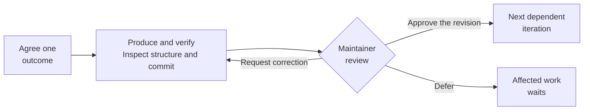
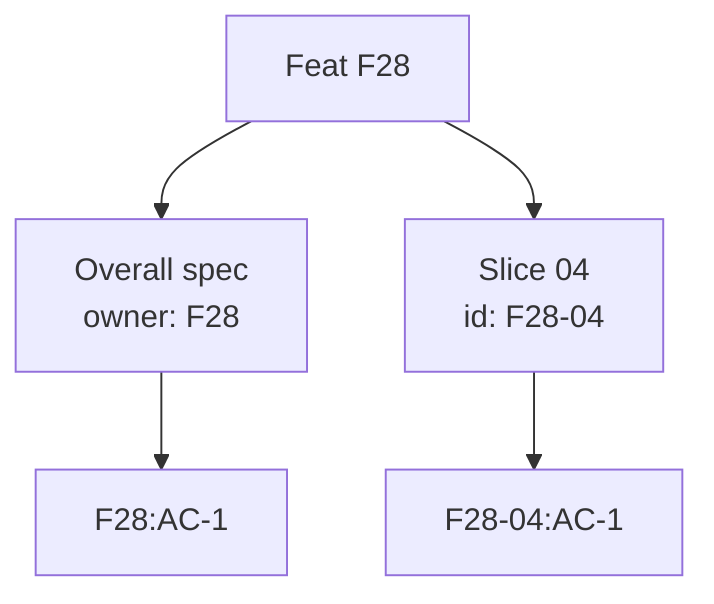

# Reviewable workflow specification

## Problem and outcome

Large artifacts make it easy to skim a plausible summary and defer the actual
review. The maintainer needs small, frequent reviews to control project direction,
technical debt, semantics, and architecture while learning changes the design.
Execution needs precise constraints; discovery needs room to investigate.

Deliver the six principles below through the [delivery slices](README.md#delivery-order),
then evaluate them by replaying the familiar parallel-execution slice. This file
owns overall contracts. The slices own their local contracts and evidence.
Shared meanings belong to the [glossary](../../ubiquitous-language.md#delivery-workflow).

## Visual overview

### What permits the next iteration?

This illustrates [the review gate](#3-advance-through-explicit-review), with
[structural review](#5-constrain-execution-and-make-drift-visible) before
presentation: `F28:AC-1`, `F28:AC-2`, and `F28:AC-8`. The sections below own the
full contracts, including revalidation, approval scope, and authorized work.

### Why can two criteria both be AC-1?

The same local number identifies different criteria in different owning scopes.
See [acceptance ID scope](#acceptance-id-scope) and
[test mapping](design.md#acceptance-evidence). This is an identity map, not a
claim of passing evidence.

## 1. Size iterations for human review

Plan one coherent question, decision, or observable result per iteration.
Include the context, actual diff, test or experiment evidence, and consequences
in the review burden. Aim for an initial review in under five minutes; split
work that needs more. A short summary cannot make a large implementation small.

The maintainer's feedback determines whether an artifact was understandable.
Record a rough review-time estimate and actual feedback, without requiring a
timer. Diff size and complexity can flag a step for discussion; neither proves
it meets the review budget. Questions and revisions can extend the conversation.

## 2. Present a concrete review artifact

Present a concise review entry point: the intended outcome; the exact revision
or comparison range and affected files, or an example or investigation result;
checks run and their limitations; consequential architecture, vocabulary,
compatibility, or debt changes; and one proposed next step. State the decision
requested and link evidence.

Assume the maintainer reviews repository changes in their own tools, such as
Magit or an editor/IDE. The agent must not print or paste the diff into chat.
Identify the changes for review in those tools, then explain them and answer
questions as the maintainer examines them.

The maintainer can ask for explanation, redirect, request a correction, accept,
or defer. The artifact must expose the actual work. A convincing narrative or
a green check summary alone does not satisfy the review contract.

## 3. Advance through explicit review

Agree the next outcome, produce it, verify it, inspect structure and refactor
where needed, reverify changed behavior, commit any repository changes, and
present the exact artifact. Discuss or revise it, then record explicit approval
before starting the next dependent iteration. Unchanged research can use a
versioned evidence record; no empty code commit is needed.

Approval identifies its scope and revision. A changed reviewed artifact needs
review of its changes. Passing checks, elapsed time, silence, and an agent-written
approval field do not authorize continuation or merging. Corrections requested
for the current artifact can proceed within that request. Independent work
continues only when the maintainer has authorized it.

## 4. Use the loop during discovery and delivery

Defining steps can investigate a bounded question about a library, tool, or
approach. State the hypothesis, alternatives, stopping condition, isolated probe,
versions, commands, observations, and limits. Present findings before adoption.
Failed experiments are useful evidence; they do not automatically settle a choice.

Apply the same loop to prototype experiments, observable contracts, consequential
design choices, preparatory refactoring, and implementation. A prototype keeps
lightweight notes grouped by investigation. Promotion to a regular feat slice
requires a reviewed gap assessment and normal production validation. It does not
turn exploratory code into completed implementation by changing its status.

Rewrites use migration slices with explicit preserved behavior, intentional
changes, comparison evidence, cutover, and retirement. Reuse historical contracts
as references and validate the new implementation. Avoid a separate elaborate
rewrite framework or an index entry for every experimental run.

## 5. Constrain execution and make drift visible

An executor session follows the approved scope, observable contracts, applicable
ADRs, architecture, glossary, and conventions. A discrepancy or consequential
new choice produces a concrete proposal before affected implementation proceeds.
Routine implementation choices remain autonomous within the approved outcome.

Both defining and executor sessions inspect cohesion, module ownership, type
meaning, dependencies, and documentation ownership before presenting a step.
Fold similar types only when their meaning and invariants match; preserve useful
variants and precise narrowing. Move helpers to their owning modules. A generic
utility module is not an automatic destination. No refactoring can be a valid
result; avoid compulsory cleanup or speculative abstraction.

Classify review findings as implementation defects, ambiguity, changed behavior,
or discovered hazards. Preserve an already sufficient contract; tighten ambiguous
or changed contracts through review. Record hazards where they help future work.
Do not encode a particular lock or formatter setting as an observable requirement.

## 6. Keep records small and authoritative

Use [the package ownership and revision model](design.md#documents-and-revisions).
The overview routes readers; the specification owns contracts; the design owns
proposed relationships; the append-only journal explains consequential events.
Git retains textual history. Correct a journal entry with a new entry referring
to it. Avoid transcript dumps, duplicated state, or separate human and agent specs.

Give feat specifications and designs compact Mermaid views of important behavior
or relationships. Each view answers one review question, uses shared vocabulary
and stable acceptance IDs where relevant, and links to its owning contracts.
Keep spatial layout stable between revisions when practical and make material
changes visible. The prose owns precise requirements; diagrams illustrate them.
Review the rendered views for readability and consistency with those requirements.

Group independently usable outcomes into feat slices and review their smaller
steps. Parent scope governs integration; child criteria do not repeat it. Use
stable acceptance IDs and plain pytest coverage markers, with explicit evidence
for criteria verified by other methods. Tracking links reuse issue and PR numbers;
a step does not require a new issue, directory, or journal file.

## Scope and exclusions

Include document schemas and navigation, mechanical documentation checks,
acceptance traceability, bounded tool investigations, an STE suitability decision,
structural review guidance, and the later manual parallel replay evaluation.
Historical records migrate only when necessary, through reviewed changes.

Exclude autonomous direction-setting or agent consortium design, new trading
behavior, broad unrelated refactoring, mandatory Obsidian use, behave/Gherkin glue,
and a second documentation framework. Unslop is dropped from consideration.
This proposal authorizes no reversal; slice 06 requires a separate reviewed plan
after workflow adoption.

## Acceptance ID scope

A criterion's identity is its owning feat or feat slice ID plus its local `AC-n`
ID. A textual reference outside that namespace uses `<scope>:AC-n`, such as
`F28:AC-1` or `F28-04:AC-1`. Test markers supply the same scope explicitly through
the [marker contract](design.md#acceptance-evidence).

For `kind: spec`, the namespace is the frontmatter `owner`, which must resolve to
a registered feat or feat slice. For `kind: slice`, it is the frontmatter `id`.
A specification document's own ID, such as `F28-SPEC`, identifies the document,
not its acceptance namespace. File paths do not determine criterion identity.

Bare `AC-n` references are local to their owning namespace. Criterion definitions
are unique within that namespace across all files; different namespaces can reuse
the same local number. Moving files preserves IDs. Retired IDs remain reserved.

`make docs-check` must validate namespace resolution, definition uniqueness,
and references against the complete acceptance index. Unknown namespaces,
duplicate definitions within a namespace, unqualified external references,
dangling references, and retired-ID reuse produce findings. Collection-aware test
reference checks join this target through slice 04; references do not prove tests
passed or sufficiently assert the requirement. Incremental selection retains
the relevant cross-file and test dependencies.

## Journal identity and session references

For `kind: journal`, frontmatter `owner` resolves to the registered feat or feat
slice whose events it records. Event IDs use `J-n` and are unique across all
journals for that owner. External references qualify the owner, such as
`F28:J-8`; bare references are local. Moving or splitting journals preserves
identity. Never renumber or reuse an event ID; numbering gaps are allowed.
Corrections append an event referring to the original.

Each agent entry records its date, delivery role (`defining` or `executor`), and
session reference separately. Declare a local session reference, such as `S1`,
once in a journal event with a recognizable name, `provider`, and the provider's
native `thread_id`. The reference shares the journal owner's scope; external
references use `F28:S1`. Within that owner, a resumed conversation keeps the same
reference and native identity; a new conversation gets a new reference and
identity. Changing delivery role does not create a new conversation.

Obtain native identity from trusted runtime metadata. If it is unavailable,
record `thread_id: null`, the reason, and a recognizable name or resumable link;
do not invent an ID. A declared reference remains usable across file moves and
journal splits. Append an explicit association for legacy entries whose session
was recorded ambiguously; preserve their original text and identify the events
and verified identity or uncertainty. This compatibility rule does not excuse
missing identity metadata in new entries.

`make docs-check` must validate journal owners, event uniqueness and references,
entry dates and roles, session declarations and references, and provider identity
fields. Codex native thread IDs are UUIDs; other provider formats need explicit
profiles. Null identity requires an unavailability reason. Check append-only
history and legacy associations against the declared base. Incremental selection
retains related journals, declarations, and inbound references.

Repository checks do not require access to private conversation history. A native
history availability check is optional and local; report unavailable or unrun
access honestly. An ID does not import a conversation into another agent's
context. Session metadata identifies the recording agent, not human approval or
independent review; approval evidence remains a separate journal event contract.

## Overall acceptance criteria

IDs are scoped to `F28`, remain stable, and are never reused after retirement.
The evidence column names the intended method, not completed validation.

| ID | Preconditions and action | Observable outcome | Verified by |
| --- | --- | --- | --- |
| AC-1 | Plan and present an iteration in each workflow phase | One coherent result, actual evidence, and a short review entry point; oversized work is split following maintainer feedback | Manual evaluation in slice 06 |
| AC-2 | Request explanation, correction, or a change of direction after a step | The session responds and revises the artifact; no next dependent iteration starts before explicit approval | Manual evaluation and journal/revision checks |
| AC-3 | Resume from the feat overview | Current next action and approval scope are discoverable without reading the whole history; one owner exists per fact | Documentation checks and manual navigation review |
| AC-4 | Revise approved contracts or applicable design | A material change is identified and reviewed before implementation; approval names a revision and covered documents | History-check fixtures and manual approval evidence |
| AC-5 | Investigate rumdl, schemas, parsers, Ruff rules, and STE candidates | Bounded reproducible findings lead to reviewed choices; sourdough uv and package reports are investigated, not assumed fixed | Slice 02 evidence review |
| AC-6 | Run full or selected documentation validation | Hygiene, metadata, references, history, and required capabilities have honest outcomes; dependency changes are not hidden by path selection | Slice 03 integration tests and CI |
| AC-7 | Map acceptance criteria to tests or another evidence source | Namespace and reference checks reject invalid identities; uncovered IDs fail at the applicable stage; mapping and observed passing evidence are distinct; skipped tests do not validate criteria | Slice 03 namespace fixtures and slice 04 pytest/checker tests |
| AC-8 | Complete a defining or execution step | Structural review is recorded; refactoring remains scoped and preserves meaning and boundaries | Step review and existing Ruff, type, Tach, and behavior checks |
| AC-9 | Evaluate and pilot an STE checker | The maintainer sees compatibility, false positives, coverage, and maintenance costs; required language checks cannot silently skip | Slice 05 evidence and integration tests if adopted |
| AC-10 | Adopt the workflow, then separately approve reversal and replay | Parallel contracts and original evidence are preserved; every replay step is reviewed; findings assess review burden and steering | Slice 06 manual report plus behavior checks |

Completion requires the implemented guidance and required checks, a disposition
for STE, and the maintainer's review of the replay evaluation. Publishing or
approving this specification alone does not complete issue #28.
