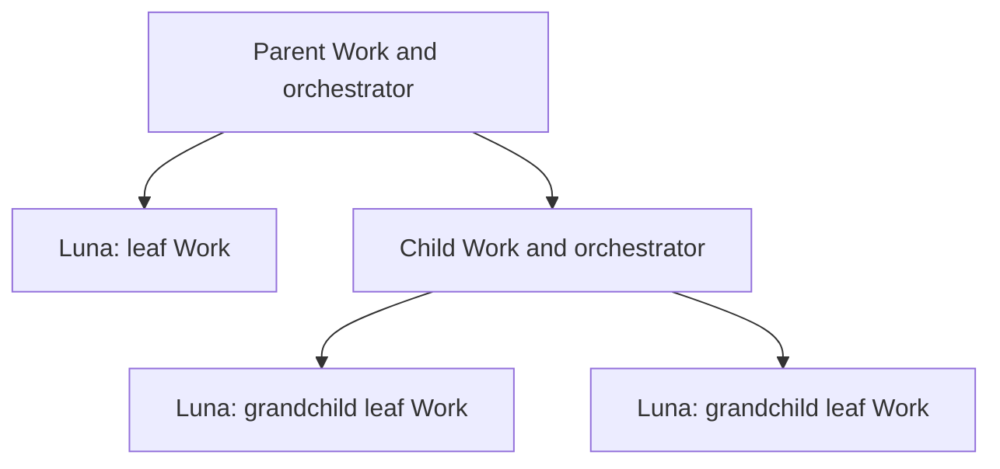

# Tree orchestration

Define orchestration roles and review ownership for a Work tree in the
authoritative [orchestrator guidance](../../../../../orchestrator.md). One
orchestrator owns a Work node with children and manages its immediate child
agents. Delegate each leaf directly to Luna at low reasoning effort; its
owning parent reviews it. A child node with children has an orchestrator owner
for that subtree. Each leaf has one responsible orchestrator; do not add a
dedicated Sol wrapper around a leaf by default.

Work-tree nodes provide responsibility boundaries. Do not invent intermediary
Work nodes solely to justify runtime layers. Parent and subtree reviews own
integration and interfaces, and reuse leaf check evidence instead of repeating
a full leaf review. Schedule by dependency readiness, concurrency limits, and
expected shared edits; do not launch the entire tree blindly. Preserve
independent executor review, maintainer approval for model or effort changes,
human merge control, and full CI gates.

A Work node is a responsibility and contract boundary; an executor is a
runtime agent assigned to a node. Leaf Work delegation does not need a separate
runtime wrapper.

## Proposed decision

Deliver this Work before any handoffs Work that edits the same orchestrator
owner. Its delivery must create a WDR through the
[WDR lifecycle](../../../../../wdr-workflow.md), recording the rationale and
tradeoffs for tree ownership and direct leaf delegation. The comparison must
cover tree routing against the earlier
per-leaf wrapper arrangement and cite durable PR or revision references for
timing evidence. The [parent's observations](../README.md) are planning input:
agent-reported batches of about 34 and 38 minutes; delayed launches and about
13 seconds of initial overlap despite available slots in the second run; about
11 minutes spent drafting PR evidence; shared-file conflicts; and formatting
rework. These observations came from different scopes and do not establish
causal attribution or controlled speedup. Token cost and actual human review
time remain unavailable. At delivery, use the next unused WDR number; its
initial status is Proposed until maintainer acceptance, then follow the WDR
lifecycle. Preserve accepted history; if the eventual choice amends or
replaces an accepted decision, follow the amendment or supersession lifecycle.

This plan requires the WDR as a child delivery outcome; it does not create a
record or accept a decision.

## Acceptance

- **AC-1 TODO** Current guidance defines the tree roles, direct low-effort leaf
  delegation, single leaf review owner, subtree integration review, evidence
  reuse, and dependency-aware scheduling while preserving all stated gates.
  Verification: inspect the owner guidance and trace the diagram's handoffs
  and review responsibilities.
- **AC-2 TODO** A WDR compares tree routing with the prior per-leaf wrapper
  arrangement, records rationale and tradeoffs, cites durable PR or revision
  evidence, and distinguishes reports from causal claims and unknown costs or
  review time. Delivery uses the next unused number and lifecycle status,
  preserving accepted history.
  Verification: inspect the proposed record, its index entry, linked guidance,
  and lifecycle status.
