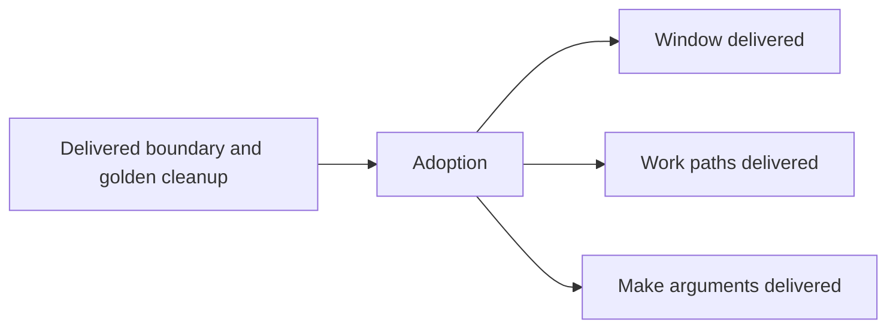

# Hypothesis pilots

Introduce Hypothesis after the relevant boundary cleanup, preserving named
examples and independently specified expectations.

## Delivery map

- **DONE** Adoption: locked development dependency, bounded local/CI settings
  and narrow lasting guidance.
- **DONE** Window: newest-first results at every input prefix match an
  independent sequence model across bounded capacities and values.
- **DONE** Work paths: generated canonical and malformed paths plus contained
  and escaping relative symlinks are checked at the resolver.
- **DONE** Make arguments: literal four-value transport through real Make with
  absent execution markers.

Adoption adds the development dependency and lockfile plus narrowly scoped
owned guidance/configuration. Start with 100 examples for in-process properties
and 25 for subprocess properties. Disable subprocess timing deadlines while
retaining process timeouts; use deterministic CI generation. Construct fresh
mutable/filesystem state per example instead of suppressing fixture health
checks. Keep generated inputs bounded and retain named hostile examples.

The three reviewed pilots followed adoption and their corresponding cleanup.
They do not authorize a wholesale conversion or new broker/Git state machines.
Adoption and the window, Work paths, and Make arguments pilots are delivered.
Serialize shared settings and maps. Each complete leaf includes helpers/type
changes within about five-minute review; escalate and merge revised contracts
before expansion. Reuse full-folder strict coverage for `src`, `script`, `test`
and `example`, with the existing intentional-negative expectations route,
rather than per-file lists. No production repair or performance claim. Preserve
named cases and provenance.

- **AC-1 TODO** Given the adopted bounded settings and fresh per-example state,
  the three independently reviewed pilots prove ordering/truncation, canonical
  Work containment and literal Make transport without replacing named examples
  or weakening behavior, type precision or isolation.

  Validation: independently review all four child outcomes, selected generated
  and named-case execution, settings/isolation and strict-folder evidence, then
  run doc/ac checks. Final-head full CI remains the separate merge gate.
